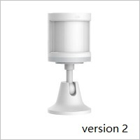
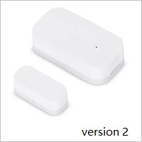
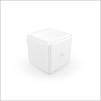

# C# Library for using xiaomi smart gateway in your automation scenarious

This library provides simple and flexible C# API for Xiaomi Mi Home devices.  

Currently supports only Xiaomi Smart Gateway, Air Humidifier and several sensors. Please see the pictures below.









>**Warning** : This is experimental version. It may be very unstable.

## Installation
via nuget package manager
```nuget
Install-Package MiHomeLib
```
or
```nuget
dotnet add package MiHomeLib
```
or install via [GitHub packages](https://github.com/sergey-brutsky/mi-home/packages/540443)

## Setup Gateway
Before using this library you should setup development mode on your gateway.

Here is an instruction --> https://www.domoticz.com/wiki/Xiaomi_Gateway_(Aqara)

>**Warning**: If you bought a new revision of Mi Home Gateway (see picture bellow)<br>
<br>
it could be possible that ports on your gateway required for UDP multicast traffic are **closed**.<br>
Before using this library they must be opened.<br>
[Instruction](https://community.openhab.org/t/solved-openhab2-xiaomi-mi-gateway-does-not-respond/52963/114)

>**Warning**: Mi Home Gateway uses udp multicast for messages handling.<br>
> So your app **must** be hosted in the same LAN as your gateway.<br>
> If it is not you **have to** use multicast routers like [udproxy](https://github.com/pcherenkov/udpxy) or [igmpproxy](https://github.com/pali/igmpproxy) or [vpn briding](https://forums.openvpn.net/viewtopic.php?t=21509)

>**Warning** : If your app is running on windows machine, make sure that you disabled virtual network adapters like VirtualBox, Hyper-V, Npcap, pcap etc.<br>
> Because these adapters may prevent proper work of multicast traffic between your machine and gateway

## Usage examples

Get all devices in the network

```csharp
public static void Main(string[] args)
{
    // pwd of your gateway (optional, needed only to send commands to your devices) 
    // and sid of your gateway (optional, use only when you have 2 gateways in your LAN)
    using var miHome = new MiHome();

    miHome.OnAnyDevice += (_, device) =>
    {
        Console.WriteLine($"{device.Sid}, {device.GetType()}, {device}"); // all discovered devices
    };

    Console.ReadLine();
}
```

### Supported devices

### 1. Gateway


```csharp
using var miHome = new MiHome();

miHome.OnGateway += (_, gateway) =>
{
    gateway.EnableLight();
    Task.Delay(3000).Wait();
    gateway.DisableLight();
    Task.Delay(3000).Wait();
    gateway.StartPlayMusic(1); // Track number 1 (tracks range is 0-8, 10-13, 20-29)
    Task.Delay(3000).Wait();
    gateway.StopPlayMusic();
};
```

### 2. Temperature and humidity sensor


```csharp
using var miHome = new MiHome();

miHome.OnThSensor += (_, thSensor) =>
{
    if (thSensor.Sid == "158d000182dfbc") // sid of specific device
    {
        Console.WriteLine(thSensor); // Sample output --> Temperature: 22,19°C, Humidity: 74,66%, Voltage: 3,035V

        thSensor.OnTemperatureChange += (_, e) =>
        {
            Console.WriteLine($"New temperature: {e.Temperature}");
        };

        thSensor.OnHumidityChange += (_, e) =>
        {
            Console.WriteLine($"New humidity: {e.Humidity}");
        };
    }
};
```

### 3. Socket Plug


```csharp
using var miHome = new MiHome();

miHome.OnSocketPlug += (_, socketPlug) =>
{
    if (socketPlug.Sid == "158d00015dc6cc") // sid of specific device
    {
        Console.WriteLine(socketPlug); // sample output Status: on, Inuse: 1, Load Power: 2.91V, Power Consumed: 37049W, Voltage: 3.6V

        socketPlug.TurnOff();
        Task.Delay(5000).Wait();
        socketPlug.TurnOn();
    }
};
```

### 4. Motion sensor or Aqara motion sensor


```csharp
using var miHome = new MiHome();

//miHome.OnAqaraMotionSensor += (_, motionSensor) =>
miHome.OnMotionSensor += (_, motionSensor) =>
{
    if (motionSensor.Sid == "158d00015dc6cc") // sid of specific device
    {
        Console.WriteLine(motionSensor); // sample output Status: motion, Voltage: 3.035V, NoMotion: 0s

        motionSensor.OnMotion += (_, __) =>
        {
            Console.WriteLine($"{DateTime.Now}: Motion detected !");
        };

        motionSensor.OnNoMotion += (_, e) =>
        {
            Console.WriteLine($"{DateTime.Now}: No motion for {e.Seconds}s !");
        };
    }
};
```

### 5.  Door/Window sensor or Aqara open/close sensor


```csharp
using var miHome = new MiHome();

//miHome.OnAqaraOpenCloseSensor += (_, windowSensor) =>
miHome.OnDoorWindowSensor += (_, windowSensor) =>
{
    if (windowSensor.Sid == "158d00015dc6cc") // sid of specific device
    {
        Console.WriteLine(windowSensor); // sample output Status: close, Voltage: 3.025V

        windowSensor.OnOpen += (_, __) =>
        {
            Console.WriteLine($"{DateTime.Now}: Window opened !");
        };

        windowSensor.OnClose += (_, __) =>
        {
            Console.WriteLine($"{DateTime.Now}: Window closed !");
        };

    }
};
```

### 5.  Water leak sensor


```csharp
using var miHome = new MiHome();

miHome.OnWaterLeakSensor += (_, waterLeakSensor) =>
{
    if (waterLeakSensor.Sid == "158d00015dc6cc") // sid of specific device
    {
        Console.WriteLine(waterLeakSensor); // Status: no_leak, Voltage: 3.015V

        waterLeakSensor.OnLeak += (_, __) =>
        {
            Console.WriteLine("Water leak detected !");
        };

        waterLeakSensor.OnNoLeak += (_, __) =>
        {
            Console.WriteLine("NO leak detected !");
        };

    }
};
```

### 6.  Smoke sensor


```csharp
using var miHome = new MiHome();

miHome.OnSmokeSensor += (_, smokeSensor) =>
{
    if (smokeSensor.Sid == "158d00015dc6cc") // sid of specific device
    {
        Console.WriteLine(smokeSensor); // sample output Alarm: off, Density: 0, Voltage: 3.075V

        smokeSensor.OnAlarm += (_, __) =>
        {
            Console.WriteLine("Smoke detected !");
        };

        smokeSensor.OnAlarmStopped += (_, __) =>
        {
            Console.WriteLine("Smoke alarm stopped");
        };

        smokeSensor.OnDensityChange += (_, e) =>
        {
            Console.WriteLine($"Density changed {e.Density}");
        };
    }
};
```

### 7.  Wireless dual wall switch


```csharp
using var miHome = new MiHome();

miHome.OnWirelessDualWallSwitch += (_, wirelessDualSwitch) =>
{
    if (wirelessDualSwitch.Sid == "158d00015dc6cc") // sid of specific device
    {
        Console.WriteLine(wirelessDualSwitch);

        wirelessDualSwitch.OnLeftClick += (_) =>
        {
            Console.WriteLine("Left button clicked !");
        };

        wirelessDualSwitch.OnRightDoubleClick += (_) =>
        {
            Console.WriteLine("Right button double clicked !");
        };

        wirelessDualSwitch.OnLeftLongClick += (_) =>
        {
            Console.WriteLine("Left button long clicked !");
        };

    }
};
```

### 8.  Aqara cube


```csharp
using var miHome = new MiHome();

miHome.OnAqaraCubeSensor += (_, aqaraQube) =>
{
    if (aqaraQube.Sid == "158d00015dc6cc") // sid of specific device
    {
        Console.WriteLine(aqaraQube);

        aqaraQube.OnStatusChanged += (sender, eventArgs) =>
        {
            Console.WriteLine($"{sender} | {eventArgs.Status}");
        };

    }
};
```

### 9.  Air Humidifier


Before using the library you need to know IP and TOKEN of your air humidifier.
If you don't know these parameters try to use the following code in order to discover air humidifiers in your LAN
```csharp
AirHumidifier.OnDiscovered += (_, humidifier) =>
{
    Console.WriteLine($"ip: {humidifier.Ip}, token: {humidifier.Token}");
    // sample output ip: 192.168.1.5, token: 4a3a2f017b70097a850558c35c953b55
};

AirHumidifier.DiscoverDevices();
```
If your device hides his token follow [these instructions](https://www.home-assistant.io/integrations/xiaomi_miio#xiaomi-home-app-xiaomi-aqara-gateway-android--ios) in order to extract it.

Basic scenario

```csharp
var airHumidifier = new AirHumidifier("192.168.1.5", "token here");
Console.WriteLine(airHumidifier);
/* sample output
Power: on
Mode: high
Temperature: 32.6 °C
Humidity: 34%
LED brightness: bright
Buzzer: on
Child lock: off
Target humidity: 50%
Model: zhimi.humidifier.v1
IP Address:192.168.1.5
Token: 4a3a2f017b70097a850558c35c953b55
*/
```
Functions
```csharp
var airHumidifier = new AirHumidifier("192.168.1.5", "token here");
airHumidifier.PowerOn(); // power on
airHumidifier.PowerOff(); // power off
airHumidifier.SetMode(AirHumidifier.Mode.High); // set fan mode high/medium/low
airHumidifier.GetTemperature(); // get temperature
airHumidifier.GetHumidity(); // get humidity
airHumidifier.SetBrightness(AirHumidifier.Brightness.Bright); // set brighness bright/dim/off
airHumidifier.BuzzerOn(); // set buzzer sound on
airHumidifier.BuzzerOff(); // set buzzer sound off
airHumidifier.ChildLockOn(); // set child lock on
airHumidifier.ChildLockOff(); // set child lock oаа
airHumidifier.GetTargetHumidity(); // get humidity limit 20/30/40/50/60/70/80 %
```
Async versions of the operations above also supported.

When I buy more devices I will update the library
